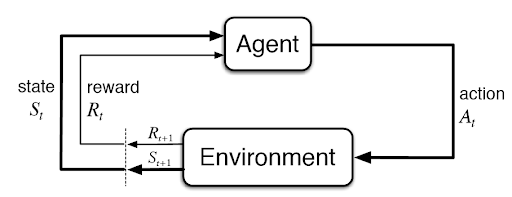
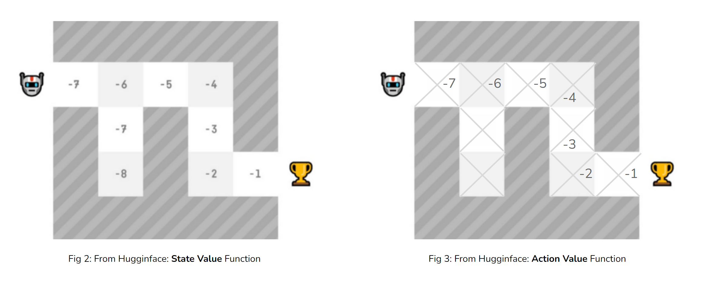
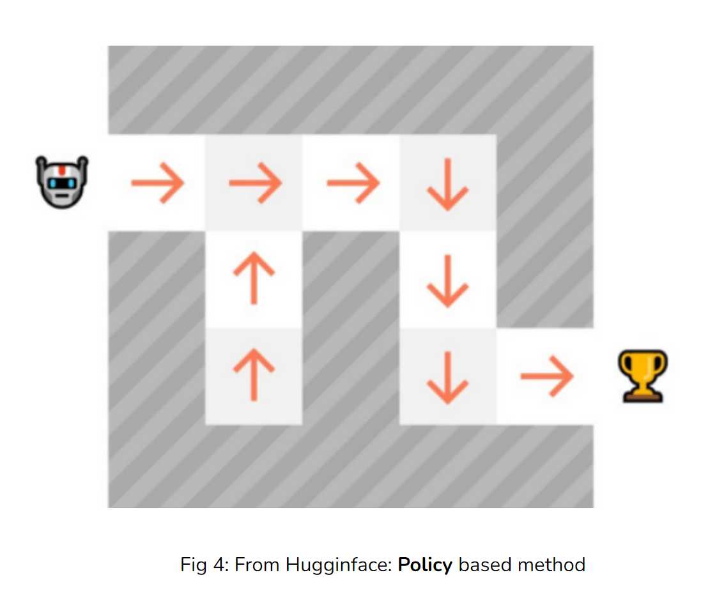

# Reinforcment Learning - RL 

Overview of reinforcment methods.

## Table of Conent 
- [What is RL?](#what-is-rl)
- [Value and Policy methods](#value-and-policy-methods)
- [Q-learning and Deep Q Network](#generative-models)
- [Policy Gradient Methods](#policy-gradient-methods)
- [Reinforce Algorithm](#reinforce-algorithm)
- [Proximal Policy Optimization](#proximal-policy-optimization)
- [Project Implementation](#project-implementation)
- [Code](#code)
- [Results](#results)

# What is RL? 

An agent is interacting in the environment. Takes an action and performs it, then enviornment gives a reward and new state. 

The goal of the agent is to learn the **optimal** policy, maximixing the expected cumulative reward. 

> "A policy is the brain of the agent. What action to take given the sate we're in."

# Two main types of RL 

## Value based methods

Estimate either state or the state action value. In state-action, given value for each action we can take in that state. 

- State-value (fig 2) or state-action-value function (fig 3)

- State -> Q(State) -> Values of state Action pair -> policy(State) -> Action

With the value functions we're indirectly learning a policy. Example policy, greedy: $\pi^* (s) = argmax_a Q^*(s,a)$. Takes the action in the state which gives the highes quality. 

## Policy based methods

- State -> policy(state) -> Action
- Determnistic policy: one action
- Stochastic polic: porbability distribution

# Q-learning and DQN 

Two value fucntions

## Q-learning 
- The Bellman Equation: used to update state, given the neighbouring states.
- Q-table (contains action value pairs)
- Given state-action pair, search Q-table
- Problem with large state space

## Deep Q-learning

Estimating the Q-values of actions given the state.

Different methods of implmenetation:

- Q-target (for example computed with bellman equation)
- Q-value prediction 
- Gradient decent on loss (Q-target - Q-prediction)
- Problem; not very stable.

# Policy Gradient Methods

Policy methods: parameterize the policy and optimize it directly. 

Training loop: 
1. Collect an episode with the policy: $(S, A, r_{t+1}, S_{t+1}, A_{t+1}, r_{t+2} ... )$
2. Calculate the return (sum of rewards). Discounted as rewards in the future worth less $R(\tau) =r_{t+1} + \gamma r_{t+2} + \gamma^2 r_{t+3} $ 
3. Update the weights of the policy:
- a) if positive return -> increase the probability of state action pairs taken in the episode
- b) if negative return -> decrease the probability of state-action pairs taken in the episode

Stochastic Policy
$$
\pi_\theta (s) = P[A|s;\theta]
$$

We have our stocastic policy, and need to evaulate the trajectories we sample for our policy. This is introudced by the objective function which is the expected return of the cumulative return. 

Objective Fucntion
$$
J(\theta) = E_{\tau ~\pi [R(\tau)]}
$$

